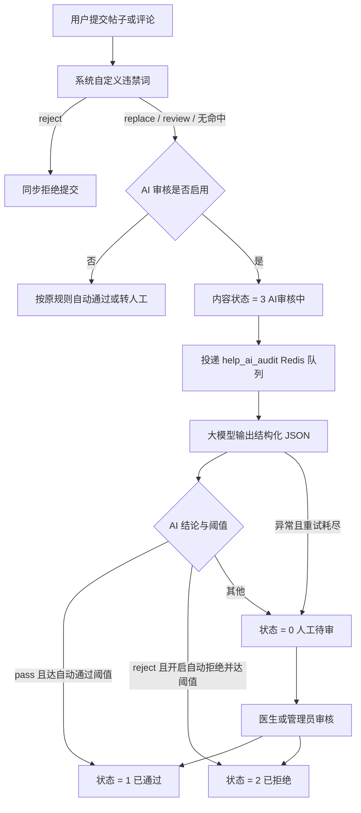

# AI 内容审核技术方案

## 1. 目标与范围

在现有“系统自定义违禁词 + 医生端审核 + 后台管理员审核”的基础上，增加可配置的大模型 AI 审核。第一期覆盖：

- 社区帖子 `community_post`
- 社区评论 `community_comment`
- 管理后台查看 AI 结论、配置审核策略、重新发起 AI 审核
- 医生审核列表查看 AI 建议，最终仍可人工通过或拒绝

本期不将图片、音频或视频内容发给模型，仅审核帖子和评论的文本。

## 2. 核心原则

1. 违禁词规则优先。`reject` 类规则继续同步拒绝，不浪费模型调用。
2. AI 异步执行。用户提交内容后进入独立 Redis 队列，不将模型延迟加到发布接口。
3. 人工结论优先。AI 回写前必须确认内容哈希未变且仍处于“AI 审核中”，不覆盖医生或管理员结论。
4. 失败安全。模型超时、格式错误或重试耗尽时转人工待审，绝不因 AI 异常自动通过。
5. 审计可追溯。保存模型、提示词版本、结论、置信度、重试次数、耗时和最终操作来源。
6. 最小数据原则。模型请求只包含审核对象类型、文本和违禁词结果，不包含 token、用户姓名或其他无关个人信息。

## 3. 审核流程



## 4. 状态定义

### 4.1 内容审核状态 `audit_status`

| 值 | 含义 | 是否对外展示 |
| --- | --- | --- |
| 0 | 人工待审 | 仅作者和审核人员可见 |
| 1 | 已通过 | 是 |
| 2 | 已拒绝 | 否 |
| 3 | AI 审核中 | 仅作者和审核人员可见 |

### 4.2 AI 任务状态 `task_status`

| 值 | 含义 |
| --- | --- |
| 0 | 已排队 |
| 1 | 处理中 |
| 2 | 已完成 |
| 3 | 失败，已转人工 |
| 4 | 已失效，内容已变更或人工已先完成审核 |

## 5. AI 输出协议

模型必须返回单个 JSON 对象：

```json
{
  "decision": "pass|review|reject",
  "risk_level": "low|medium|high",
  "confidence": 0.96,
  "categories": ["medical_misinformation"],
  "reason": "存在未经证实的治疗效果承诺",
  "matched_segments": ["包治所有症状"]
}
```

系统对结论、风险等级、置信度范围和风险分类白名单进行二次校验。待审文本被明确标记为不可信输入，以降低提示词注入风险。

支持的风险分类：`porn`、`violence`、`illegal`、`abuse`、`ads`、`privacy`、`self_harm`、`medical_misinformation`、`unsafe_medical_advice`、`minor_risk`、`spam`。

## 6. 数据与审计

迁移 `20260815090000_add_help_ai_content_audit.php` 新增：

- `sa_help_ai_audit_task`：每次 AI 审核的内容版本、模型信息、结论、重试和错误记录。
- `sa_help_audit_log.operator_type`：`system / ai / doctor / admin`。
- `sa_help_audit_log.metadata`：保存 AI 任务 ID、结论、置信度和分类等扩展证据。
- `help_ai_audit` 运行配置组。
- `help_ai_audit` Redis 内部任务队列。
- 帖子和评论的“重新 AI 审核”权限。

`request_key` 对目标、内容哈希、模型配置和提示词版本做幂等约束；管理员手动重跑时创建新的审核记录。

## 7. 后台配置

进入“HelpSupport → 运行配置 → AI 内容审核”：

| 配置 | 默认值 | 说明 |
| --- | --- | --- |
| AI 审核总开关 | 禁用 | 选好模型并完成测试后再启用 |
| 审核模型 | 未选择 | 来自已启用的 `saiai_config` |
| 审核社区帖子 | 启用 | 可独立关闭 |
| 审核社区评论 | 启用 | 可独立关闭 |
| 高置信度自动通过 | 启用 | 仅 `pass` 达阈值后生效 |
| 自动通过阈值 | 0.95 | 范围 0.50–1.00 |
| 高置信度自动拒绝 | 禁用 | 建议累积样本并完成误杀评估后再开启 |
| 自动拒绝阈值 | 0.99 | 范围 0.80–1.00 |
| 最大尝试次数 | 3 | 范围 1–5 |
| 重试间隔 | 10 秒 | 按尝试次数线性退避，上限 300 秒 |
| 补充审核政策 | 空 | 用于增加平台特有规则，不得填写密钥或个人信息 |

## 8. 管理端与医生端

- 帖子、评论后台列表增加 AI 任务状态、结论、风险等级和置信度。
- 详情页显示风险分类、风险片段、模型、耗时和错误。
- 具有独立权限的管理员可重新发起 AI 审核。
- Flutter 医生审核卡片显示 AI 建议、置信度和原因；人工操作按钮保持不变。

## 9. 上线步骤

1. 备份数据库，确认目标环境和回滚窗口。
2. 在 `server/` 执行 `php webman b8:migrate --dry-run`。
3. 确认输出后执行 `php webman b8:migrate`。
4. 在 SAIAI 模型配置中启用一个文本大模型。
5. 先保持 AI 审核总开关关闭，确认队列进程已加载 `help_ai_audit` 队列。
6. 选择审核模型，启用总开关，保持“自动拒绝”关闭。
7. 用正常、边界、明确违规、提示词注入、医疗错误信息五类样本做验收。
8. Webman 为常驻进程，发布 PHP、路由和队列配置后需 reload/restart。

## 10. 验收清单

- 违禁词 `reject` 仍同步拒绝。
- AI 关闭时，现有违禁词与人工审核流程不受影响。
- AI 开启时，新帖子和评论先进入状态 3，且队列生成可追踪任务。
- 高置信度 `pass` 按阈值自动通过。
- `review`、低置信度结论和默认的 `reject` 转人工待审。
- 模型超时、非 JSON、非法结论可重试，耗尽后转人工。
- 医生或管理员先完成审核后，迟到的 AI 结果不能覆盖人工结论。
- 修改内容后，旧内容哈希对应的 AI 结果不能回写。
- 审核日志能区分 AI、系统、医生和管理员。

## 11. 回滚策略

- 紧急停用时优先在运行配置中关闭 AI 审核总开关，新内容立即回到原有审核链路。
- 队列中已投递的任务仍有内容哈希和状态校验，不会覆盖已变更或已人工审核的内容。
- 数据库回滚会删除新增配置、队列、权限、任务表和日志扩展字段。
- 如 `sa_help_ai_audit_task` 已有审核记录，迁移会拒绝回滚，必须先备份并按审计要求清理，避免误删审核证据。
