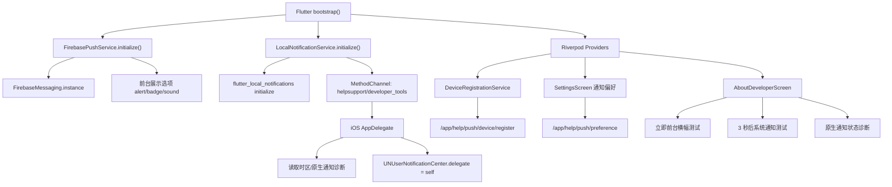

# HelpSupport 通知说明与架构

## 1. 文档目的

这份文档面向后续维护者，说明 `helpsupport-next` 当前仓库里的通知相关实现、职责边界、关键文件、iOS 特殊要求、调试入口和后续扩展约束。

重点结论先写在前面：

- 当前仓库已经打通两条链路：
  - 服务端推送初始化、设备注册、通知偏好同步。
  - 本地通知初始化、权限申请、iOS 真机前台/后台横幅自测。
- 当前仓库**还没有**完成真正的业务级本地提醒调度（例如治疗任务、日记提醒自动排程）。`LocalNotificationService` 目前主要承担：
  - 插件初始化。
  - 权限辅助。
  - 开发者工具里的本地通知链路验证。
  - 后续业务通知调度的基座。

## 2. 通知职责划分

当前产品语义已经在设置页固定下来：

- 本地通知：
  - 适合设备本机即可决定的提醒。
  - 例如治疗任务提醒、日记提醒、离线陪伴提醒。
- 服务端推送：
  - 适合后端事件驱动的消息。
  - 例如社区互动、预约状态、系统公告、审核结果。

对应 UI 文案来源：

- [flutter_app/lib/features/me/presentation/settings_screen.dart](/Users/openb8/Downloads/项目/helpsupport-next/flutter_app/lib/features/me/presentation/settings_screen.dart)

其中通知设置页当前文案已经明确：

- “治疗任务和日记提醒走本地通知；社区、预约和系统公告走服务端推送。”

## 3. 当前代码结构

### 3.1 Flutter 侧

- 本地通知服务：
  - [flutter_app/lib/core/notifications/local_notification_service.dart](/Users/openb8/Downloads/项目/helpsupport-next/flutter_app/lib/core/notifications/local_notification_service.dart)
- Firebase 推送服务：
  - [flutter_app/lib/core/push/firebase_push_service.dart](/Users/openb8/Downloads/项目/helpsupport-next/flutter_app/lib/core/push/firebase_push_service.dart)
- 通知权限封装：
  - [flutter_app/lib/core/permissions/permission_service.dart](/Users/openb8/Downloads/项目/helpsupport-next/flutter_app/lib/core/permissions/permission_service.dart)
- 应用启动初始化：
  - [flutter_app/lib/app/bootstrap.dart](/Users/openb8/Downloads/项目/helpsupport-next/flutter_app/lib/app/bootstrap.dart)
- 设备注册：
  - [flutter_app/lib/features/auth/data/device_registration_service.dart](/Users/openb8/Downloads/项目/helpsupport-next/flutter_app/lib/features/auth/data/device_registration_service.dart)
- 通知设置页：
  - [flutter_app/lib/features/me/presentation/settings_screen.dart](/Users/openb8/Downloads/项目/helpsupport-next/flutter_app/lib/features/me/presentation/settings_screen.dart)
- 开发者通知测试页：
  - [flutter_app/lib/features/me/presentation/about_developer_screen.dart](/Users/openb8/Downloads/项目/helpsupport-next/flutter_app/lib/features/me/presentation/about_developer_screen.dart)

### 3.2 iOS 原生侧

- iOS AppDelegate：
  - [flutter_app/ios/Runner/AppDelegate.swift](/Users/openb8/Downloads/项目/helpsupport-next/flutter_app/ios/Runner/AppDelegate.swift)

这里除了 App 启动以外，还承担两件事：

- 显式设置 `UNUserNotificationCenter.current().delegate = self`
- 暴露开发者工具专用 MethodChannel：
  - `helpsupport/developer_tools`

当前这个通道只用于：

- 读取 iOS 当前时区
- 读取原生通知诊断信息

### 3.3 后端 API

- 路由：
  - [server/plugin/help/config/route.php](/Users/openb8/Downloads/项目/helpsupport-next/server/plugin/help/config/route.php)
- 控制器：
  - [server/plugin/help/app/api/controller/PushController.php](/Users/openb8/Downloads/项目/helpsupport-next/server/plugin/help/app/api/controller/PushController.php)

当前已落地的通知相关接口：

- `POST /app/help/push/device/register`
- `POST /app/help/push/device/unregister`
- `GET /app/help/push/preference`
- `POST /app/help/push/preference`

## 4. 当前启动链路

### 4.1 App 启动

入口见：

- [flutter_app/lib/app/bootstrap.dart](/Users/openb8/Downloads/项目/helpsupport-next/flutter_app/lib/app/bootstrap.dart)

当前顺序是：

1. `WidgetsFlutterBinding.ensureInitialized()`
2. `timezone.initializeTimeZones()`
3. 创建 `LocalNotificationService`
4. 创建 `FirebasePushService`
5. 异步初始化本地通知服务
6. 异步初始化 Firebase 推送服务
7. 将服务通过 Riverpod Provider 注入应用

这里有一个维护约束：

- `notificationService.initialize()` 和 `firebasePushService.initialize()` 目前都用了 `unawaited(...)`。
- 也就是说，通知能力失败时不会阻塞应用启动。
- 如果后续要把“登录后必须完成 token 注册”做成强约束，不能直接改这里硬等，而要在登录/设备注册链路单独控制。

### 4.2 Firebase 推送初始化

入口见：

- [flutter_app/lib/core/push/firebase_push_service.dart](/Users/openb8/Downloads/项目/helpsupport-next/flutter_app/lib/core/push/firebase_push_service.dart)

当前初始化行为：

1. `Firebase.initializeApp()`
2. 获取 `FirebaseMessaging.instance`
3. 调用 `setForegroundNotificationPresentationOptions(alert: true, badge: true, sound: true)`
4. 标记 `_available = true`

这里第 3 步很关键：

- 如果不设置前台展示选项，iOS 真机上即使通知触发，也可能出现“触发了但没有前台横幅”的现象。
- 当前仓库已经补上这一点。

### 4.3 本地通知初始化

入口见：

- [flutter_app/lib/core/notifications/local_notification_service.dart](/Users/openb8/Downloads/项目/helpsupport-next/flutter_app/lib/core/notifications/local_notification_service.dart)

当前初始化行为：

1. 通过 `helpsupport/developer_tools` MethodChannel 读取 iOS 当前时区
2. 将时区同步到 `timezone.local`
3. 初始化 `flutter_local_notifications`
4. 在 Darwin 初始化参数里开启：
   - `defaultPresentAlert`
   - `defaultPresentBadge`
   - `defaultPresentSound`
   - `defaultPresentBanner`
   - `defaultPresentList`

## 5. 设备注册与通知偏好

### 5.1 设备注册

入口见：

- [flutter_app/lib/features/auth/data/device_registration_service.dart](/Users/openb8/Downloads/项目/helpsupport-next/flutter_app/lib/features/auth/data/device_registration_service.dart)

注册时会向后端上传：

- `device_id`
- `platform`
- `fcm_token`
- `apns_token`
- `app_version`
- `locale`
- `timezone`

当前用途：

- 后端知道当前账号有哪些设备
- 后端知道 iOS 设备的 APNs / FCM token
- 后端可以按设备、语言、时区下发推送

### 5.2 通知偏好

Flutter 侧读写入口：

- [flutter_app/lib/features/me/data/settings_repository.dart](/Users/openb8/Downloads/项目/helpsupport-next/flutter_app/lib/features/me/data/settings_repository.dart)
- [flutter_app/lib/features/me/presentation/settings_screen.dart](/Users/openb8/Downloads/项目/helpsupport-next/flutter_app/lib/features/me/presentation/settings_screen.dart)

当前偏好项包括：

- 总通知开关 `is_push_enabled`
- 任务提醒 `is_task_reminder_enabled`
- 社区互动 `is_community_enabled`
- 预约提醒 `is_appointment_enabled`
- 审核/系统通知 `is_audit_notice_enabled`
- 本地陪伴提醒 `is_local_companion_enabled`
- 免打扰时间 `quiet_start_time` / `quiet_end_time`

维护约束：

- 设置页切换开关时会立即调用 `POST /app/help/push/preference`
- 这里目前已经是“本地 UI 状态 + 服务端持久化”双向同步模型
- 后续新增通知类型时，必须同时改：
  - Flutter 设置页 payload
  - `PushController` 的 APIDOC
  - `HelpApiService::savePushPreference`

## 6. iOS 侧特殊要求

这是当前通知链路里最容易踩坑的部分。

### 6.1 必须显式设置通知代理

当前代码：

- [flutter_app/ios/Runner/AppDelegate.swift](/Users/openb8/Downloads/项目/helpsupport-next/flutter_app/ios/Runner/AppDelegate.swift)

当前已补齐：

```swift
if #available(iOS 10.0, *) {
  UNUserNotificationCenter.current().delegate = self
}
```

如果去掉这行，前台本地通知/前台横幅可能出现这些现象：

- 通知已经触发，但当前页没有横幅
- 开发者工具里看到授权、锁屏、通知中心设置都正常
- `pending=0`，但用户仍然看不到任何展示

这不是猜测，是当前仓库在 2026-06-18 的真机联调中实际踩过的坑。

### 6.2 Scene 模式下不要依赖 `rootViewController` 注册通道

当前仓库已经切到 `FlutterSceneDelegate` 场景模式。

因此开发者工具 MethodChannel 没有走 `window?.rootViewController`，而是改成：

- 通过 `registrar(forPlugin:)` 拿到 messenger
- 再创建 `FlutterMethodChannel`

否则会出现：

- Flutter 侧取不到真机时区
- 诊断通道无响应
- UI 上显示时间与系统时间差 8 小时（退回 UTC）

### 6.3 Firebase 与本地通知插件会共享 `UNUserNotificationCenterDelegate`

当前项目同时使用：

- `firebase_messaging`
- `flutter_local_notifications`

这意味着：

- iOS 前台展示逻辑会受 delegate 接管顺序影响
- 不能只看 Flutter 层是否 `show()` 成功
- 必须同时核对：
  - `UNUserNotificationCenter.current().delegate`
  - Firebase 前台展示选项
  - Darwin 初始化展示选项

## 7. 开发者工具页的用途

开发者页入口在“关于 App”里点击版本号 9 次进入。

相关页面：

- [flutter_app/lib/features/me/presentation/about_developer_screen.dart](/Users/openb8/Downloads/项目/helpsupport-next/flutter_app/lib/features/me/presentation/about_developer_screen.dart)

当前通知测试分成三类：

### 7.1 立即前台横幅

用途：

- 验证 app 停留在前台页面时，系统横幅是否立刻出现

如果失败，优先排查：

- `UNUserNotificationCenter.current().delegate = self` 是否丢了
- Firebase 前台展示选项是否开启
- `DarwinInitializationSettings` / `DarwinNotificationDetails` 的 `presentBanner`、`presentList` 是否被改掉

### 7.2 3 秒后系统通知

用途：

- 验证 app 回桌面或锁屏后的系统通知投递链路

当前实现：

- `zonedSchedule(...)`
- 使用真机时区
- 清空旧通知后重新排程

### 7.3 刷新通知状态

用途：

- 读取 iOS 原生通知诊断信息

当前展示的诊断信息来自 `AppDelegate.swift`，包括：

- 授权状态 `authorizationStatus`
- `alertSetting`
- `soundSetting`
- `badgeSetting`
- `lockScreenSetting`
- `notificationCenterSetting`
- `alertStyle`
- `timeZoneIdentifier`
- `pendingCount`
- `deliveredCount`

## 8. 当前架构图



## 9. 当前现状与后续扩展边界

### 9.1 已经完成的

- Firebase 初始化
- FCM/APNs token 读取
- 设备注册/注销接口接入
- 通知偏好读写
- iOS 本地通知权限与前台横幅链路打通
- 开发者工具页自测和原生诊断

### 9.2 还没完成的

当前仓库**没有**这些生产级能力：

- 治疗任务提醒的正式本地排程表
- 日记提醒的正式本地排程表
- 本地通知点击后的统一业务路由跳转
- 本地通知与服务端消息的去重策略
- 免打扰时间对本地排程的统一裁剪
- Android 真机通知架构专项文档

因此后续如果要继续做通知业务，推荐新增这些组件，而不是继续把业务逻辑堆进 `LocalNotificationService`：

- `notification_scheduler.dart`
- `notification_payload.dart`
- `notification_router.dart`
- `notification_preference_service.dart`

## 10. 维护规则

### 10.1 不要随意删掉这些配置

- `AppDelegate.swift` 中的 `UNUserNotificationCenter.current().delegate = self`
- `FirebasePushService.initialize()` 中的 `setForegroundNotificationPresentationOptions(...)`
- `LocalNotificationService.initialize()` 中的 Darwin 默认展示选项
- 开发者工具页里的通知诊断入口

### 10.2 新增通知类型时要同步的地方

至少同步下面几层：

1. 后端 `PushController` APIDOC
2. 后端 `HelpApiService` 偏好保存逻辑
3. Flutter 设置页开关与 payload
4. 如涉及本地提醒，再补本地调度层
5. 开发者工具页增加必要自测项

### 10.3 验证建议

通知相关改动后，最低建议验证：

1. iOS 真机 `flutter run -d <device id>`
2. 开发者页 `立即前台横幅`
3. 开发者页 `3 秒后系统通知`
4. 开发者页 `刷新通知状态`
5. 设置页通知偏好切换后检查接口是否成功

不要用 `flutter analyze` 代替通知链路验证。

## 11. 2026-06-18 这次真机排障结论

这次通知排障中，实际确认过的关键问题如下：

- iOS 前台横幅不出现，不等于权限没开，更多时候是 delegate 链路不完整。
- 只看 `pendingCount` 不够，要同时看：
  - 是否前台
  - `UNUserNotificationCenter.delegate`
  - Firebase 前台展示选项
  - Darwin `presentBanner/presentList`
- Scene 模式下如果 MethodChannel 注册方式不对，时区会退回 UTC，表现为“通知计划时间错 8 小时”。
- 当诊断显示：
  - `auth=authorized`
  - `alert=enabled`
  - `lock=enabled`
  - `center=enabled`
  - `style=banner`
  但前台仍无横幅时，优先怀疑 delegate/插件接管问题，而不是权限问题。

后续如果再次出现“通知触发了但没显示”的情况，先按这份文档排查，不要先改业务代码。
