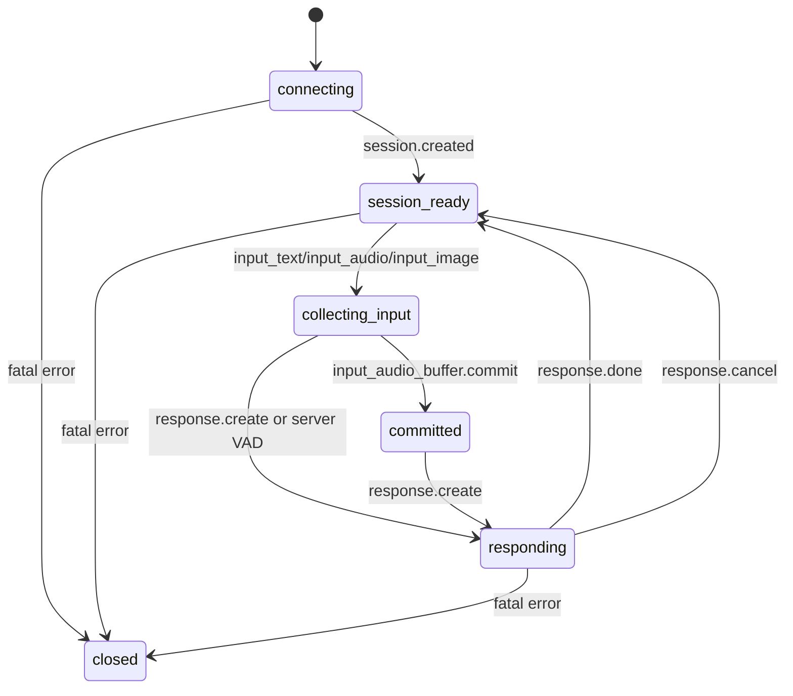

# SAI AI 插件说明

本文档说明 `saiai` 插件在 B8AIadmin 中的功能边界、配置方式、阿里云实时多模态接入、后台测试台使用和排障流程。

## 功能定位

`saiai` 是框架内置 AI 能力插件，当前包含两类能力：

| 能力 | 入口 | 说明 |
| --- | --- | --- |
| 文字对话 | `server/plugin/saiai/app/service/AiFactory.php` | 通过 `saiai_config` 中的模型配置调用 OpenAI、Gemini、DeepSeek、Generic 等文本模型通道。 |
| SAI Realtime 多模态 | `plugin.saiai.saiai_realtime_gateway` 进程 | 后台浏览器连接本地 WebSocket 协议网关，由网关通过 provider adapter 连接阿里云 Qwen-Omni-Realtime 等上游。支持文本测试、麦克风音频、摄像头抽帧视频和音频输出监测。 |

后台前端位于 `saiadmin-artd/src/views/plugin/saiai`，后端插件位于 `server/plugin/saiai`。

## 核心数据

`saiai_config` 保存模型配置。实时模型复用该表，并通过 `options` 字段保存会话扩展配置。

常用字段：

| 字段 | 说明 |
| --- | --- |
| `name` | 配置名称。 |
| `type` | 平台类型。实时模型固定为 `realtime`。 |
| `ai_url` | 上游地址。实时模型使用 `wss://dashscope.aliyuncs.com/api-ws/v1/realtime`。 |
| `ai_key` | 阿里云 DashScope API Key。也可留空并使用环境变量 `DASHSCOPE_API_KEY`。 |
| `model` | 模型名，当前默认 `qwen3-omni-flash-realtime-2025-12-01`。 |
| `options` | JSON 扩展配置，可覆盖默认会话参数。 |
| `status` | 非实时默认配置需要启用；后台实时测试页指定 `config_id` 时允许测试未启用配置。 |

实时模型初始化由迁移 `Database/migrations/20260606000600_add_saiai_aliyun_realtime.php` 完成：

- 为 `saiai_config` 增加 `options` 字段。
- 插入实时示例配置，并通过后续迁移归一为 `realtime`。
- 增加后台菜单“实时测试”和权限 `saiai:realtime:test`。

## 配置项

### 环境变量

写在 `server/.env`：

```ini
SAIAI_REQUEST_TIMEOUT=3600
DASHSCOPE_API_KEY=
SAIAI_REALTIME_PUBLIC_URL=
SAIAI_REALTIME_WS_PORT=8791
SAIAI_REALTIME_WS_COUNT=1
```

| 变量 | 默认值 | 说明 |
| --- | --- | --- |
| `SAIAI_REQUEST_TIMEOUT` | `3600` | AI 对话等待上游数据的空闲超时秒数；总请求时长为该值再加 60 秒，慢模型可按需调大。 |
| `DASHSCOPE_API_KEY` | 空 | 当 `saiai_config.ai_key` 为空时作为兜底 API Key。 |
| `SAIAI_REALTIME_PUBLIC_URL` | 空 | 对外可访问的实时代理地址。生产环境可显式配置为 `wss://{host}/v1/realtime`；为空时按请求协议自动生成。 |
| `SAIAI_REALTIME_WS_PORT` | `8791` | 本地实时代理 WebSocket 监听端口。 |
| `SAIAI_REALTIME_WS_COUNT` | `1` | 实时代理进程数。 |

### 平台类型

`server/plugin/saiai/config/ai.php` 控制后台可选平台类型。实时模型类型为：

```php
'realtime'
```

厂商适配器写入 `options.provider`，当前阿里云 Qwen 使用：

```json
{
  "provider": "aliyun_qwen"
}
```

### 实时模型默认值

默认值集中在 `server/plugin/saiai/app/service/AliyunRealtimeConfig.php`：

| 项 | 默认值 |
| --- | --- |
| 模型 | `qwen3-omni-flash-realtime-2025-12-01` |
| 上游 WebSocket | `wss://dashscope.aliyuncs.com/api-ws/v1/realtime` |
| 音色 | `Cherry` |
| 输出模态 | `["text", "audio"]` |
| 输入音频 | `pcm`，16 kHz PCM 流 |
| 输出音频 | `pcm`，24 kHz PCM 流 |
| VAD | `server_vad`，`threshold=0.5`，`silence_duration_ms=800` |

`options` 可覆盖会话参数，例如：

```json
{
  "modalities": ["text", "audio"],
  "voice": "Cherry",
  "instructions": "你是 B8AIadmin 的实时语音助手，请用准确、简洁、友好的中文回答用户。",
  "turn_detection": {
    "type": "server_vad",
    "threshold": 0.5,
    "silence_duration_ms": 800
  },
  "input_audio_transcription": {
    "model": "qwen3-asr-flash-realtime"
  },
  "smooth_output": true,
  "temperature": 0.9,
  "top_k": 50,
  "repetition_penalty": 1.05,
  "presence_penalty": 0
}
```

## SAI Realtime 协议

SAI Realtime 是类 OpenAI `/v1/realtime` 的最小 WebSocket 协议层。它不追求完整厂商兼容，只稳定 saiai 自己的事件、状态机和 session 配置，再通过 provider adapter 翻译到不同厂商。

对外端点：

```text
wss://{host}/v1/realtime?model={model}
```

后台测试页本地开发默认使用：

```text
ws://127.0.0.1:8791/v1/realtime?model={model}&token={admin_token}&config_id={id}
```

鉴权：

- 浏览器测试台使用 `token` 查询参数传递 SaiAdmin JWT。
- 服务端或非浏览器客户端优先使用 `Authorization: Bearer <token>`。
- 网关会校验 JWT 中的 `plat=saiadmin`，厂商 API Key 只保存在服务端。

### 客户端事件

| 事件 | 说明 |
| --- | --- |
| `session.update` | 更新会话配置。 |
| `input_audio_buffer.append` | 追加一段 base64 PCM16 音频。 |
| `input_audio_buffer.commit` | 手动提交当前音频缓冲。 |
| `input_text.append` | 追加一段文本输入。 |
| `input_image.append` | 追加一帧图片输入，通常是 JPEG 抽帧。 |
| `response.create` | 请求模型开始生成。 |
| `response.cancel` | 取消当前生成。 |
| `ping` | 心跳探测。 |

### 服务端事件

| 事件 | 说明 |
| --- | --- |
| `session.created` | 会话已创建且 provider 上游已就绪。 |
| `session.updated` | 会话配置已更新。 |
| `response.started` | 本轮响应开始。 |
| `response.text.delta` | 文本增量。 |
| `response.audio.delta` | base64 PCM16 音频增量。 |
| `response.done` | 本轮响应结束。 |
| `error` | 协议、鉴权、provider 或内部错误。 |
| `pong` | 心跳响应。 |

### Session 配置

```json
{
  "modalities": ["text", "audio"],
  "instructions": "你是 B8AIadmin 的实时语音助手。",
  "input_audio_format": "pcm16",
  "output_audio_format": "pcm16",
  "voice": "Cherry",
  "turn_detection": {
    "type": "server_vad",
    "threshold": 0.5,
    "silence_duration_ms": 800
  },
  "temperature": 0.9,
  "tools": []
}
```

说明：

- 音频统一使用 base64 PCM16。阿里云 adapter 会把协议层的 `pcm16` 翻译为 Qwen 上游需要的 `pcm`，并把上游 session 返回的 `pcm` / `pcm24` 归一成协议层 `pcm16`。
- `tools` 当前只作为协议字段保留，第一版不触发工具调用事件。
- `manual` 模式的 `turn_detection` 可传 `null` 或 `{ "type": "manual" }`。

### JSON 示例

创建会话后服务端会返回：

```json
{
  "type": "session.created",
  "event_id": "srv_123",
  "session_id": "sess_123",
  "provider": "aliyun_qwen",
  "model": "qwen3-omni-flash-realtime-2025-12-01",
  "session": {
    "modalities": ["text", "audio"],
    "input_audio_format": "pcm16",
    "output_audio_format": "pcm16",
    "voice": "Cherry"
  },
  "status": "ready"
}
```

文本输入：

```json
{
  "type": "input_text.append",
  "event_id": "evt_text_1",
  "text": "请介绍一下你看到的画面"
}
```

音频输入：

```json
{
  "type": "input_audio_buffer.append",
  "event_id": "evt_audio_1",
  "audio": "<base64 pcm16>"
}
```

图片帧输入：

```json
{
  "type": "input_image.append",
  "event_id": "evt_image_1",
  "image": "<base64 jpeg>",
  "mime_type": "image/jpeg",
  "timestamp_ms": 1200
}
```

请求生成：

```json
{
  "type": "response.create",
  "event_id": "evt_response_1"
}
```

输出增量：

```json
{
  "type": "response.audio.delta",
  "event_id": "srv_audio_1",
  "session_id": "sess_123",
  "response_id": "resp_123",
  "delta": "<base64 pcm16>"
}
```

### 状态机



### Provider Adapter

Adapter 接口位于 `server/plugin/saiai/app/realtime/adapter/RealtimeProviderAdapterInterface.php`，第一版真实实现阿里云 Qwen adapter，并预留 OpenAI Realtime、Gemini Live、本地 ASR+LLM+TTS 的扩展入口。

伪代码：

```php
interface RealtimeProviderAdapterInterface
{
    public function upstreamUrl(array $config): string;
    public function upstreamHeaders(array $config): array;
    public function defaultSession(array $options = []): array;
    public function toProviderEvents(array $event, RealtimeSessionState $state): array;
    public function fromProviderEvent(array $event, RealtimeSessionState $state): array;
}
```

当前 adapter：

| Provider | 类 | 状态 |
| --- | --- | --- |
| 阿里云 Qwen Omni Realtime | `AliyunQwenRealtimeAdapter` | 已实现。 |
| OpenAI Realtime | `UnsupportedRealtimeAdapter('openai_realtime')` | 已预留，未接上游。 |
| Gemini Live | `UnsupportedRealtimeAdapter('gemini_live')` | 已预留，未接上游。 |
| 本地 ASR+LLM+TTS | `UnsupportedRealtimeAdapter('local_realtime')` | 已预留，未接本地流水线。 |

### 错误码

| 错误码 | 场景 |
| --- | --- |
| `invalid_json` | 客户端事件不是合法 JSON object。 |
| `unsupported_event` | 客户端事件不在最小协议白名单内。 |
| `invalid_session` | session 字段非法，例如音频格式或 VAD 模式不支持。 |
| `invalid_audio` | `audio` 不是 base64 PCM16。 |
| `invalid_image` | `image` 为空或图片事件非法。 |
| `invalid_path` | WebSocket 路径不是 `/` 或 `/v1/realtime`。 |
| `authentication_error` | 缺少 token、JWT 无效或平台不匹配。 |
| `upstream_not_ready` | Provider 上游尚未连接完成。 |
| `provider_connection_error` | 上游连接错误。 |
| `provider_connection_closed` | 上游连接关闭。 |
| `provider_protocol_error` | 上游返回了非 JSON 事件。 |
| `internal_error` | 未归类内部错误。 |

## 实时代理

实时代理进程配置在 `server/plugin/saiai/config/process.php`：

```php
'saiai_realtime_gateway' => [
    'handler' => plugin\saiai\app\process\RealtimeGateway::class,
    'listen' => 'websocket://0.0.0.0:' . env('SAIAI_REALTIME_WS_PORT', 8791),
    'count' => (int) env('SAIAI_REALTIME_WS_COUNT', 1),
    'reloadable' => true,
]
```

连接链路：

1. 后台测试台连接本地代理：`ws://<host>:8791/v1/realtime?model=<model>&token=<admin_token>&config_id=<id>`。
2. 代理校验 SaiAdmin JWT，确认 `plat=saiadmin`。
3. 代理读取 `saiai_config` 中的 `realtime` 配置。
4. 代理选择 provider adapter，当前默认 `aliyun_qwen`。
5. Adapter 连接阿里云实时端点，并用 `Authorization: Bearer <api_key>` 放在服务端请求头中。
6. 前端只与本地代理通信，不直接暴露阿里云 API Key。

修改 PHP、进程配置或 `.env` 后，需要重启 Webman：

```bash
cd server
php start.php stop
php start.php start -d
php start.php status | rg "saiai_realtime|8791|exit_status|exit_count"
```

### Nginx 反向代理

生产环境对外使用标准端点：

```text
wss://{host}/v1/realtime?model={model}
```

Nginx 必须把 `/v1/realtime` 代理到实时 WebSocket 进程端口 `8791`，不能落到普通 Webman HTTP 入口。宝塔站点里通常把 `location` 放在当前站点配置中，并确保它位于通用 `/` 代理规则之前。

Docker 发布模式下，`docker.sh` 默认会发布 `8791:8791`。如果需要调整宿主机端口，可在执行脚本时设置 `SAIAI_REALTIME_HOST_PORT`；如果不需要对宿主机发布实时端口，可设置 `PUBLISH_SAIAI_REALTIME_PORT=0`。

`map` 需要放在 Nginx 的 `http` 作用域，不能放进单个 `server` 作用域：

```nginx
map $http_upgrade $connection_upgrade {
    default upgrade;
    '' close;
}
```

站点 `server` 配置中加入：

```nginx
location /v1/realtime {
    proxy_pass http://127.0.0.1:8791;
    proxy_http_version 1.1;

    proxy_set_header Upgrade $http_upgrade;
    proxy_set_header Connection $connection_upgrade;
    proxy_set_header Host $host;
    proxy_set_header X-Real-IP $remote_addr;
    proxy_set_header X-Forwarded-For $proxy_add_x_forwarded_for;
    proxy_set_header X-Forwarded-Proto $scheme;

    proxy_read_timeout 3600s;
    proxy_send_timeout 3600s;
    proxy_buffering off;
}
```

本地开发可以直接连：

```text
ws://127.0.0.1:8791/v1/realtime?model={model}&token={admin_token}&config_id={id}
```

线上浏览器页面必须通过 HTTPS 站点发起 `wss://` 连接，由 Nginx 完成 TLS 终止和 WebSocket Upgrade。

后台测试台会按当前请求协议自动生成代理地址；HTTPS 页面会优先使用同源 `wss://{host}/v1/realtime`，避免浏览器 Mixed Content 拦截。如反代链路无法正确传递协议头，可在 `.env` 中配置 `SAIAI_REALTIME_PUBLIC_URL=wss://{host}/v1/realtime`。

## 后台实时测试台

入口：后台菜单 `SAIAI 管理中心 -> 实时测试`。

前端文件：`saiadmin-artd/src/views/plugin/saiai/realtime/test/index.vue`。

后端配置接口：

```http
GET /app/saiai/admin/config/AiConfig/realtimeTestConfig
```

测试台能力：

| 模块 | 说明 |
| --- | --- |
| 会话配置 | 切换输出模态、音色、VAD、采样参数、系统提示，并发送 `session.update`。 |
| 状态监测 | 展示本地代理、Provider 上游、会话状态、生成状态、延迟、错误数。 |
| 文本测试 | 发送 `input_text.append` 并观察服务端是否接受。 |
| 音频测试 | 采集麦克风，转换为 16 kHz PCM 后通过 `input_audio_buffer.append` 发送。 |
| 音视频测试 | 同时开启麦克风和摄像头，从视频流抽 JPEG 帧通过 `input_image.append` 发送。 |
| 音频输出 | 收到 `response.audio.delta` 后流式播放，`audio.done` 后生成完整 WAV 供回放。 |
| 日志监测 | 按发送、接收、错误分类展示事件，并摘要音频和图片 Base64。 |

## 输入与输出流程

### 音频

浏览器采集麦克风后转换为单声道 16 kHz PCM，并持续发送：

```json
{
  "type": "input_audio_buffer.append",
  "audio": "<base64 pcm16>"
}
```

### 视频

WebSocket 模式不直接传 RTP 视频流。测试台从摄像头视频流按 FPS 抽取 JPEG 图像帧，并发送：

```json
{
  "type": "input_image.append",
  "image": "<base64 jpeg>",
  "mime_type": "image/jpeg",
  "timestamp_ms": 1200
}
```

注意：

- 图像帧需要与音频一起形成一轮输入；不要把“纯视频”当成主要测试路径。
- 当前后台测试台的主流程是“开始音视频通话”，会同时开启麦克风和摄像头。
- “发送单帧”只用于调试抽帧效果，必须在麦克风和摄像头都开启后使用。

### 输出

服务端可能返回：

| 事件 | 处理 |
| --- | --- |
| `response.started` | 标记本轮生成开始。 |
| `response.text.delta` | 追加到实时文本区。 |
| `response.audio.delta` | 流式播放 PCM16 音频，并统计音频下行。 |
| `response.done` | 标记本轮结束，并生成完整 WAV 回放文件。 |
| `error` | 计入错误数并写入事件日志。 |

## VAD 模式

| 模式 | 说明 | 适用场景 |
| --- | --- | --- |
| `server_vad` | 默认模式，服务端根据声音能量判断说话开始和结束，并自动提交本轮输入。 | 实时语音和音视频通话。 |
| `semantic_vad` | 语义断句模式，可减少附和声、短停顿和背景音误触发。 | 仅 `qwen3.5-omni-realtime` 系列支持；使用 `qwen3-omni-flash-realtime-2025-12-01` 时不要默认选择。 |
| `manual` | 关闭服务端 VAD，由前端手动 `input_audio_buffer.commit` 后再 `response.create`。 | 按住说话、语音留言、单轮录音测试。 |

VAD 模式下服务端会自动创建响应，测试台不会手动发送 `response.create`。Manual 模式才启用“Manual 提交本轮”。

## 常见问题

### 页面提示实时连接错误

检查实时代理是否启动：

```bash
cd server
php start.php status | rg "saiai_realtime|8791|exit_status|exit_count"
```

如果进程不存在或退出，重启 Webman，并查看 `server/runtime/logs/workerman.log`。

生产环境还需要检查 Nginx 是否已把 `/v1/realtime` 代理到 `127.0.0.1:8791`，并且 WebSocket Upgrade 头没有被通用 HTTP 代理规则覆盖。

### 上游连接失败

检查：

- `saiai_config.ai_key` 或 `DASHSCOPE_API_KEY` 是否填写。
- `ai_url` 是否为 `wss://dashscope.aliyuncs.com/api-ws/v1/realtime`。
- `model` 是否为当前地域支持的实时模型。
- API Key 是否属于北京地域或对应地域。

### 视频没有反应

WebSocket 实时视频不是单独的视频流，必须与音频输入一起形成一轮上下文。请使用“音视频 -> 开始音视频通话”，不要只发送单帧。

### 只看到文字，听不到声音

检查会话配置中的 `modalities` 是否包含 `audio`，音色是否有效，浏览器是否允许自动播放音频。测试台收到 `response.audio.delta` 后会流式播放，并在 `audio.done` 后生成完整 WAV。

### Manual 模式没有回复

Manual 模式必须手动提交：

1. 开始麦克风或音视频输入。
2. 停止输入。
3. 点击“Manual 提交本轮”。

VAD 模式不需要点击提交。

## 维护要求

- 新增或修改实时端点时，同步更新：
  - `server/plugin/saiai/config/ai.php`
  - `server/plugin/saiai/app/service/AliyunRealtimeConfig.php`
  - `server/plugin/saiai/app/process/RealtimeGateway.php`
  - `server/plugin/saiai/app/realtime/adapter/*`
  - 后台测试台页面
  - `Doc/OpenAPI/saiai/openapi.yaml`
  - 本文档
- 后端 PHP 变更至少执行 `php -l`，进程或路由变更需重启 Webman 并检查 `php start.php status`。
- 前端变更至少执行 `pnpm exec vue-tsc --noEmit`，页面级变更建议执行单文件 ESLint。
- 日志和操作记录必须脱敏 `ai_key`、`api_key`、`token`、`secret`、`authorization` 等字段。

## 参考资料

- 阿里云 Qwen-Omni-Realtime 文档：https://help.aliyun.com/zh/model-studio/realtime
- 阿里云实时 API 客户端事件：https://www.alibabacloud.com/help/en/model-studio/client-events
